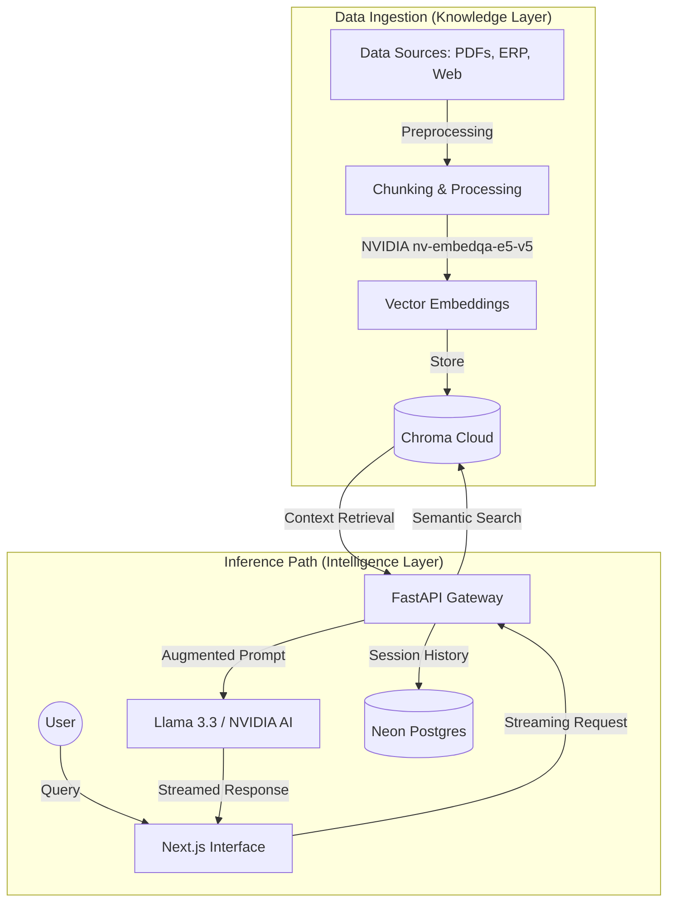

#  SNUGPT

  
  
  
  
  

  <strong>The Student Brain Engine.</strong> 
  <em>The ultimate institutional intelligence layer for the SNU Ecosystem.</em>

---

## ⚡ The SNUGPT Overhaul (V1.0.4)

SNUGPT has been transformed from a standard chatbot into a high-density **Neural Intelligence Interface**. Designed for students who need precision without the noise.

### ✨ What's New?
- **🧠 Compact Neural UI**: Re-engineered for standard laptop viewports. Everything you need, visible at first glance.
- **✨ Character Reveal Engine**: High-fidelity text animations for a premium, conversational feel.
- **🌊 Ambient Neural Backgrounds**: Dynamic grid systems and pulsing ambient glows that respond to your presence.
- **🛡️ Built-in Guardrails**: University-aligned intelligence that respects academic integrity and institutional policies.
- **📱 Responsive by Design**: Seamlessly scaling from 4K workstations to mobile devices.

| Feature | Description |
| :--- | :--- |
| **🧠 Deep Context** | Surfacing precise info from course catalogs, policies, and manuals. |
| **🌊 Live Streaming** | Token-by-token response streaming for a commercial-grade feel. |
| **🛡️ Secure Memory** | Persistent session tracking with Neon PostgreSQL and asyncpg. |
| **📱 Premium UI** | Framer Motion animations and high-contrast dark mode aesthetics. |
| **🔄 Self-Improving** | Integrated feedback loops for continuous model alignment. |

---

## 🏗️ Neural Architecture & Information Flow

### 🔄 Retrieval Augmented Generation (RAG) Flow

### 🛠️ Technical Stack

- **Large Language Model**: Meta Llama 3.3 70B Instruct (via NVIDIA AI Endpoints)
- **Vector Intelligence**: ChromaDB Cloud with `nv-embedqa-e5-v5` embeddings
- **Backend Architecture**: FastAPI (Asynchronous Python 3.12+)
- **Frontend Interface**: Next.js 14 (App Router) with Framer Motion 11
- **Primary Database**: Neon PostgreSQL (Serverless)
- **Styling & Components**: Tailwind CSS + Lucide Icons

---

## 🎯 Strategic Use Cases

### 🏫 Academic Intelligence
- **Course Navigator**: Prerequisites, professor insights, and credit mapping.
- **Policy Oracle**: Instant answers on hostel rules, fee structures, and appeals.
- **Research Buddy**: Quickly surface relevant citations from institutional papers.

### 🏢 Organizational Layer
- **Unified Search**: Bridge the gap between fragmented ERP data and student queries.
- **Automated Support**: Reduce administrative load by resolving common queries instantly.

---

## 📄 License & Attribution

Copyright **2026 Rishabh Joshi**

Licensed under the **Apache License 2.0**. This project is open-source and free for commercial use, modification, and distribution, provided attribution is maintained.

> [!IMPORTANT]
> For the complete legal text, please refer to the [FULL LICENSE](./LICENSE) file.

---

  Made with ❤️ by <a href="https://github.com/rishabhh0001">Rishabh Joshi</a>

