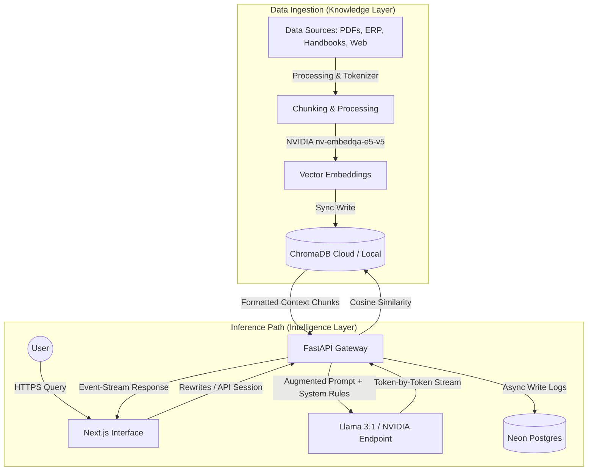

#  SNUGPT — Delhi-NCR

<p align="center">
  
  
  
  
  
</p>

<p align="center">
  <strong>The Student Brain Engine.</strong><br />
  <em>The ultimate institutional intelligence layer for the Shiv Nadar University (SNU, Delhi-NCR) Ecosystem.</em><br />
  <strong>Production Domain:</strong> <a href="https://snugpt.rishabhj.in">https://snugpt.rishabhj.in</a>
</p>

---

## ⚡ The SNUGPT Overhaul (v1.3)

SNUGPT is an open-source, high-density, conversational intelligence layer built exclusively for the Shiv Nadar University student body. It bridges the gap between fragmented ERP portals, university handbooks, hostel policies, and course prerequisites by consolidating all campus data into a unified, instant-response system.

### ✨ What's New in v1.3 (+89)?
*   **🕰️ Temporal Query Expansion Engine**: Features a prompt preprocessor that automatically intercepts student queries and appends real-time context (e.g., `Current Date: May 2026, Semester: Spring 2026`) before query execution, ensuring the retrieval matching targets the active policies instead of obsolete prior handbooks.
*   **🏎️ Zero-Buffering SSE Streaming**: Refactored backend routing to leverage Server-Sent Events (SSE) combined with a serverless Next.js Edge proxy, routing chunked token-by-token updates in real-time, reducing Time-To-First-Token and visually breathing life into the chat interface.
*   **📂 Recursive Batch Vector Ingestion**: Re-engineered `backend/scripts/upload_text.py` to recursively scan `docs/` for `.txt`, `.md`, and `.pdf` files, splitting documents dynamically via custom langchain loaders and recursive separators, uploading to ChromaDB in fast batches of 100.
*   **📈 Dynamic GitHub Commit & Deployment Timeline**: A stunning public updates selector (`/updates` & `/changelog`) loaded dynamically via parallel client-side requests using standard HSL Conventional Commits style and caching repo state in `localStorage` with offline fallback triggers.
*   **🌐 Interactive WebGL Draggable Globe**: Beautiful, responsive WebGL globe inside the cosmic 404 page created using `cobe` with velocity momentum solvers via `framer-motion` springs.
*   **🔄 Cross-Tab Settings & Theme Sync**: Synchronizes all customized names, bios, preloader flags, and visual modes in real-time across parallel browser tabs using native browser `storage` context events.
*   **🎨 HSL Theme Hardening & Ripples**: Transformed text input layers to standard CSS variables (`bg-[var(--color-surface)]`, etc.) and integrated Pointer Event ripple animations relative to tap vectors.
*   **👥 Multi-User Authentication Ecosystem**: Beautiful, seamless NextAuth.js dropdown trigger integration featuring popovers for user profile routes, notification feeds, customized developer settings, and authentication handlers.

---

## 🏗️ Technical Architecture & Information Flow

SNUGPT operates on a decoupled architecture containing a Next.js 16.2 frontend interface, a Python 3.12+ FastAPI backend, Chroma Vector Database for retrieval matching, and serverless Neon PostgreSQL for session persistence.



### 🛠️ Core Technology Stack
*   **Frontend**: Next.js 16.2 (App Router, Turbopack, Framer Motion 12, Lucide Icons, TypeScript)
*   **Backend**: FastAPI 0.111+ (Python 3.12, Asynchronous event loops, CORS middleware)
*   **Vector Pipeline**: ChromaDB Client integrated with NVIDIA's `nv-embedqa-e5-v5` embedding models
*   **SQL Database**: Serverless Neon PostgreSQL utilizing `asyncpg` pools for non-blocking I/O
*   **Styling**: Tailwind CSS + Custom CSS Variables matching a premium, glassmorphic dark-mode palette

---

## 📂 Codebase & Folder Structure

```text
├── backend/
│   ├── app/
│   │   ├── api/             # Specific API routing handlers
│   │   ├── models/          # Pydantic schemas and database pool models
│   │   │   ├── chat_log.py  # User feedback and conversation logs
│   │   │   ├── database.py  # PostgreSQL driver connections via asyncpg
│   │   │   ├── schemas.py   # Complete API request & response types
│   │   │   └── waitlist.py  # Waitlist registry database connections
│   │   ├── rag/             # Retrieval Augmented Generation logic
│   │   │   ├── pipeline.py  # Augmented prompt building and inference execution
│   │   │   └── vectorstore.py # Chroma DB interaction queries and data ingestion
│   │   ├── config.py        # Central Pydantic Settings configuration parser
│   │   └── main.py          # FastAPI application initialization & routing gateways
│   └── scripts/             # Data upload and vector migration scripts
├── src/
│   ├── app/                 # Next.js App Router (Layouts, Robots, Sitemap)
│   │   ├── about/           # Vision details and core technical specifications
│   │   ├── chat/            # High-fidelity student query workspace
│   │   ├── demo/            # Interactive loading UI mockup
│   │   ├── license/         # Open-source Apache 2.0 disclosures
│   │   ├── privacy-policy/  # Student confidentiality policies & data encryption metrics
│   │   ├── globals.css      # Core tailwind directives and canvas background classes
│   │   ├── layout.tsx       # Root layout containing Google Tag Manager and Analytics
│   │   └── page.tsx         # Responsive Homepage, waitlist portal, and features
│   ├── components/          # Reusable custom UI components
│   │   ├── ui/              # Atomized UI components (Preloader, Spinner, Inputs)
│   │   ├── ChatInterface.tsx# Primary conversational UI wrapper
│   │   ├── MessageBubble.tsx# Token streaming and markdown rendering cells
│   │   └── Sidebar.tsx      # Persistent user navigation drawer
│   └── lib/                 # Tailwind design utilities
├── public/                  # Static assets (Favicons, SVG graphics, avatar.svg)
├── vercel.json              # Reverse-proxy routes mapping frontend requests to backend paths
└── package.json             # Frontend package configurations and scripts
```

---

## 🔌 API Gateway Specifications

All backend endpoints are hosted behind a custom reverse proxy mapping `/api/py/*` or custom rewrites `/api/*` to the local python runner.

### 1. Conversational Chat Engine
Initiates a conversational sequence, performing vector retrieval on campus manuals before querying the underlying model. Returns an `event-stream` flow.
*   **Path**: `POST /api/chat`
*   **Request Payload (`ChatRequest`)**:
    ```json
    {
      "query": "What are the hostel curfew timings for girls?",
      "history": [
        {
          "role": "user",
          "content": "Hi, I have a doubt regarding campus life."
        },
        {
          "role": "assistant",
          "content": "Of course! What would you like to know about Shiv Nadar University?"
        }
      ],
      "session_id": "8fa52f20-b4df-4ec8-b391-f925facbda31"
    }
    ```
*   **Response Stream**: Token chunks formatted as Server-Sent Events (SSE).

---

### 2. Waitlist Registration
Adds student credentials to the serverless Neon DB registry.
*   **Path**: `POST /api/waitlist`
*   **Request Payload (`WaitlistRequest`)**:
    ```json
    {
      "first_name": "R******",
      "mobile_number": "+919876******",
      "email_address": "r****@snu.edu.in"
    }
    ```
*   **Response Payload**:
    ```json
    {
      "message": "Successfully joined the waitlist"
    }
    ```

---

### 3. Feedback Loop Ingestion
Logs student reactions, trigger vector store reinforcements in real-time context loops.
*   **Path**: `POST /api/chat/feedback`
*   **Request Payload (`FeedbackRequest`)**:
    ```json
    {
      "chat_id": "4fa81bc0-5e82-411a-bdcf-fc8b1236da41",
      "message_id": "90b5d21a-cf8f-4122-8ea5-05e8fbfa65bc",
      "action": "up"
    }
    ```
*   **Response Payload**:
    ```json
    {
      "message": "Successfully captured feedback: up"
    }
    ```

---

### 4. Interactive Chat Sharing
Generates snapshots of chat sessions, returning vector-rendered sharing URLs along with complete base64 SVG QR codes.
*   **Path**: `POST /api/share`
*   **Request Payload (`ShareChatRequest`)**:
    ```json
    {
      "messages": [
        { "role": "user", "content": "What is the prerequisites for OS?" },
        { "role": "assistant", "content": "The prerequisites for Operating Systems (CSD311) is Data Structures." }
      ],
      "title": "OS Prerequisites",
      "session_id": "8fa52f20-b4df-4ec8-b391-f925facbda31"
    }
    ```
*   **Response Payload (`ShareChatResponse`)**:
    ```json
    {
      "share_id": "18fbd245-a7b2-4cd8-b011-37f2a1bda4f2",
      "share_url": "https://snugpt.rishabhj.in/share/18fbd245-a7b2-4cd8-b011-37f2a1bda4f2",
      "qr_code_base64": "data:image/svg+xml;base64,PHN2ZyB4bWxucz0iaHR0c..."
    }
    ```

---

## 🚀 Step-by-Step Installation & Local Setup

Ensure you have **Node.js (v18+)**, **Python (v3.12+)**, and **Git** installed on your workstation.

### Step 1: Clone the Repository
```bash
git clone https://github.com/rishabhh0001/snugpt.git
```

### Step 2: Set up the Python Backend
Initialize a clean virtual environment and install all server dependencies:
```bash
# Create virtual environment
python -m venv .venv

# Activate virtual environment
# On Windows PowerShell:
.venv\Scripts\Activate.ps1
# On MacOS/Linux:
source .venv/bin/activate

# Install requirements
pip install -r requirements.txt
```

### Step 3: Run the Local Backend
Configure your local environment variables in `backend/.env` (using `DATABASE_URL` and `NVIDIA_API_KEY`), then trigger the server:
```bash
# Run server using Python from the project root
python -m uvicorn app.main:app --host 127.0.0.1 --port 8000 --reload
```
You can verify the backend status at `http://127.0.0.1:8000/api/health`.

### Step 4: Set up the Next.js Frontend
Open a new terminal session, navigate to the root directory, install npm packages, and trigger the development server:
```bash
# Install packages
npm install

# Run the Next.js development server
npm run dev
```
Open `http://127.0.0.1:3000` inside your browser to access the active interface.

---

## 📄 License & Attribution

Copyright **2026 Rishabh Joshi**

Licensed under the **Apache License 2.0**. This project is open-source, allowing full freedom for modifications, commercial distributions, and individual deployments, provided proper attribution headers are preserved in derivative works.

> [!IMPORTANT]
> For complete statutory legal definitions, please refer directly to the [FULL LICENSE](./LICENSE) file.

---

<p align="center">
  Made with ❤️ by <a href="https://github.com/rishabhh0001">Rishabh Joshi</a>
</p>
